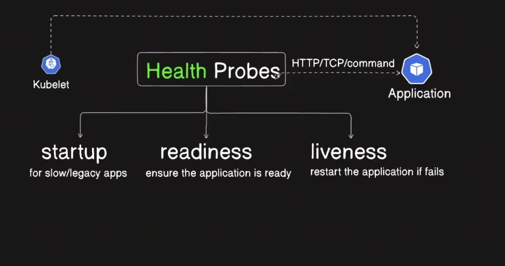

# Kubernetes Health Probes

## 🎯 Objective

* Understand **Liveness, Readiness, and Startup Probes**.
* Learn when to use each probe.
* Understand `HTTP`, `TCP`, and `Exec` health checks.
* Configure and test probes hands-on.
* Troubleshoot failed probes using `kubectl describe`.

---

# 1. What are Health Probes?

A **health probe** is a check performed by the kubelet to determine the health or readiness of a container.

Kubernetes uses probe results to take appropriate actions.

```text
Container
    ↓
Health Probe
    ↓
Success / Failure
    ↓
Kubernetes takes action
```

Kubernetes provides three main probe types:


```text
Startup
   ↓
Readiness
   ↓
Liveness
```

> **Liveness = Should I restart it?**
> **Readiness = Should I send traffic to it?**
> **Startup = Has it finished starting?**

---

# 2. Types of Probes

| Probe         | Purpose                                       | On Failure                                         |
| ------------- | --------------------------------------------- | -------------------------------------------------- |
| **Liveness**  | Detect whether the container is unhealthy     | Container is restarted                             |
| **Readiness** | Determine whether the Pod can receive traffic | Pod is removed from Service endpoints              |
| **Startup**   | Give slow-starting applications time to start | Container is restarted if startup ultimately fails |

---

# 3. Liveness Probe

A **Liveness Probe** determines whether the application is still functioning.

If the probe repeatedly fails:

```text
Liveness fails
      ↓
Kubelet considers container unhealthy
      ↓
Container is restarted
```

### When to use it

For applications that can become stuck or unhealthy but can recover after a restart.

Example:

```text
Application is running
       ↓
Application becomes deadlocked
       ↓
Liveness probe fails
       ↓
Container restarted
       ↓
Application recovers
```

### 🧠 Remember

> **Liveness failure → Restart**

---

# 4. Readiness Probe

A **Readiness Probe** determines whether the application is ready to receive traffic.

If readiness fails:

```text
Readiness fails
      ↓
Pod becomes NotReady
      ↓
Pod is removed from Service endpoints
      ↓
Traffic is not sent to the Pod
```

The container is **not restarted** just because readiness fails.

### Real-world example

Suppose an application is starting:

```text
Pod starts
   ↓
Application initializes
   ↓
Database/cache/config loading
   ↓
Readiness = Failed
   ↓
No user traffic
   ↓
Application becomes ready
   ↓
Readiness = Passed
   ↓
Traffic starts
```

### 🧠 Remember

> **Readiness failure → Stop traffic, don't restart**

---

# 5. Startup Probe

A **Startup Probe** is useful for applications that take a long time to start.

While the startup probe is failing:

* Kubernetes does not run the liveness/readiness probes.
* This prevents a slow-starting application from being restarted by its liveness probe too early.

Example:

```text
Container starts
      ↓
Startup Probe
      ↓
Still starting
      ↓
Startup probe continues
      ↓
Startup succeeds
      ↓
Liveness + Readiness begin
```

### 🧠 Remember

> **Startup = Give the application time to start**

---

# 6. Liveness vs Readiness vs Startup

```text
                 Container
                     │
                     ↓
              Startup Probe
                     │
              Startup complete
                     │
            ┌────────┴────────┐
            ↓                 ↓
      Liveness Probe     Readiness Probe
            ↓                 ↓
     Is it healthy?     Can it receive traffic?
            ↓                 ↓
        Restart         Add/remove traffic
```

### Easy memory rule

```text
Liveness  → Restart
Readiness → Traffic
Startup   → Initial startup
```

---

# 7. Probe Mechanisms

Kubernetes supports three common probe mechanisms:

### 1. HTTP GET

Kubernetes sends an HTTP request.

```yaml
httpGet:
  path: /healthz
  port: 8080
```

Success depends on receiving an appropriate HTTP response.

---

### 2. TCP Socket

Kubernetes attempts to establish a TCP connection to the specified port.

```yaml
tcpSocket:
  port: 8080
```

If the connection succeeds → probe succeeds.

If the port cannot be connected to → probe fails.

> **TCP checks whether the port is accepting a connection; it does not verify application-level health.**

---

### 3. Exec

Kubernetes executes a command inside the container.

```yaml
exec:
  command:
    - cat
    - /tmp/healthy
```

Exit code:

```text
0       → Success
Non-zero → Failure
```

```
kubectl exec -it liveness-exec -- sh

# Check file
cat /tmp/healthy

# OR check HTTP
wget -qO- http://localhost:80

# OR Check port (for TCP probe)
netstat -tuln

# OR check process
ps aux
```

---

# Important Probe Configuration Fields

Common fields:

| Field                 | Purpose                                                     |
| --------------------- | ----------------------------------------------------------- |
| `initialDelaySeconds` | Wait before the first probe                                 |
| `periodSeconds`       | Time between probes                                         |
| `timeoutSeconds`      | How long to wait for a probe response                       |
| `failureThreshold`    | Consecutive failures required to mark the probe failed      |
| `successThreshold`    | Consecutive successes required to mark the probe successful |

Example:

```yaml
livenessProbe:
  httpGet:
    path: /healthz
    port: 8080

  initialDelaySeconds: 10
  periodSeconds: 5
  timeoutSeconds: 2
  failureThreshold: 3
  successThreshold: 1
```

### 🧠 Don't confuse

```text
initialDelaySeconds
→ Delay before probing starts

periodSeconds
→ How frequently probing happens

failureThreshold
→ How many consecutive failures are required
```

---

# `initialDelaySeconds` vs Startup Probe

These are **not the same thing**.

### `initialDelaySeconds`

Simply waits before starting the probe.

```text
Container starts
     ↓
Wait 30 seconds
     ↓
Liveness probe starts
```

### Startup Probe

Actually checks whether the application has successfully started.

```text
Container starts
     ↓
Startup probe
     ↓
Still starting → keep checking
     ↓
Startup succeeds
     ↓
Liveness/Readiness begin
```

For applications with unpredictable or long startup times, a **startup probe is generally more appropriate** than relying only on a large `initialDelaySeconds`.

---

# 🧠 CKA Troubleshooting Patterns

### Pod keeps restarting

Think:

```text
Liveness probe failing
        OR
Application itself crashing
```

Check:

```bash
kubectl describe pod <pod-name>
kubectl logs <pod-name>
kubectl logs <pod-name> --previous
```

---

### Pod is `Running` but `0/1 Ready`

Think:

```text
Readiness probe failing
```

Check:

```bash
kubectl describe pod <pod-name>
```

Remember:

> **Readiness failure does not restart the container.**

---

### Application starts slowly and keeps restarting

Think:

```text
Liveness probe starts too early
        ↓
Probe fails
        ↓
Container restarted
```

Possible solution:

```text
Use a Startup Probe
```

---


### Most important memory rule

> **Liveness = Restart | Readiness = Traffic | Startup = Startup protection**
