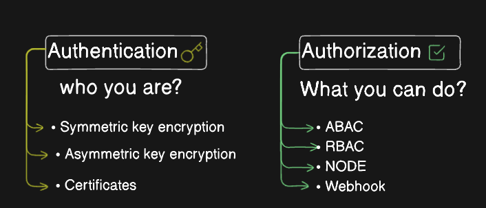

# 22 — Kubernetes Authentication and Authorization

## Objective

Understand how Kubernetes:

* Authenticates **who** is making a request
* Authorizes **what** that identity can do
* Uses `kubeconfig` for client access
* Uses authentication certificates and keys
* Configures authorization modes on the API server
* Uses **RBAC** for permissions
* Locates Kubernetes certificates on the control plane

---

# 1. Authentication — Who Are You?

**Authentication** verifies the identity of the requester.

Think of the Kubernetes API server as a secured building:

```text
User
  ↓
Authentication
  ↓
"Who are you?"
  ↓
kube-apiserver
```

Common Kubernetes authentication mechanisms include:

* Client certificates
* Service account tokens
* OIDC / external identity providers
* Other configured authentication mechanisms

For CKA, **client certificates and kubeconfig** are especially important.

---

# 2. kubeconfig

`kubectl` uses a **kubeconfig** file to know:

* Which cluster to connect to
* Which user/credentials to use
* Which context to use

Default location:

```bash
~/.kube/config
```

You can explicitly specify another file:

```bash
kubectl get pods --kubeconfig config
```

Otherwise:

```bash
kubectl get pods
```

uses the default kubeconfig.

### Basic structure

```text
kubeconfig
├── clusters
├── users
└── contexts
```

### Understand the three

```text
Cluster  → Where to connect
User     → Who you are / credentials
Context  → Which user + cluster combination to use
```

---

# 3. Useful kubeconfig Commands

View the configuration:

```bash
kubectl config view
```

List contexts:

```bash
kubectl config get-contexts
```

Show current context:

```bash
kubectl config current-context
```

Switch context:

```bash
kubectl config use-context <context-name>
```

Example:

```bash
kubectl config use-context kind-kind
```

Check the active cluster:

```bash
kubectl cluster-info
```

### CKA Memory Rule

> **Context = Cluster + User**

---

# 4. Making an API Request

Normally:

```bash
kubectl get pods
```

`kubectl` reads the kubeconfig and communicates with the Kubernetes API server.

Conceptually:

```text
kubectl
   │
   │ credentials from kubeconfig
   ▼
kube-apiserver
   │
   ├── Authentication
   │
   └── Authorization
```

You can also make a raw API request:

```bash
kubectl get --raw /api/v1/namespaces/default/pods
```

For normal CKA work, prefer `kubectl` commands rather than manually supplying certificates and server URLs.

---

# 5. Authentication vs Authorization



This distinction is extremely important.

### Authentication

```text
"Who are you?"
```

Example:

```text
CN=adam
```

The certificate identifies Adam.

### Authorization

```text
"What are you allowed to do?"
```

Example:

```text
Adam → Can get Pods
Adam → Cannot delete Deployments
```

### Memory Rule

> **Authentication = Who are you?**
> **Authorization = What can you do?**

---

# 6. Authorization in Kubernetes

After authentication, the API server determines whether the request is allowed.

Kubernetes supports several authorization mechanisms.

### Important authorization modes

| Mode          | Purpose                                        |
| ------------- | ---------------------------------------------- |
| `Node`        | Authorizes kubelets                            |
| `RBAC`        | Role-based permissions                         |
| `Webhook`     | Delegates authorization to an external service |
| `ABAC`        | Attribute-based authorization                  |
| `AlwaysAllow` | Allows all requests                            |
| `AlwaysDeny`  | Denies all requests                            |

For normal Kubernetes administration:

> **RBAC is the primary authorization mechanism you should know for CKA.**

---

# 7. Node Authorizer

The **Node authorizer** handles authorization for kubelets.

Simplified:

```text
kubelet
   ↓
kube-apiserver
   ↓
Node Authorizer
```

It controls what a kubelet can access on behalf of its node.

This is different from RBAC, although both can participate in API-server authorization.

---

# 8. RBAC — Role-Based Access Control

RBAC controls permissions using:

```text
Role / ClusterRole
        +
RoleBinding / ClusterRoleBinding
        ↓
Permissions
```

Example:

```text
User: adam
   ↓
RoleBinding
   ↓
Role: pod-reader
   ↓
get/list Pods
```

RBAC answers:

```text
Can Adam get Pods?
Can Adam create Deployments?
Can Adam delete Services?
```

Check permissions:

```bash
kubectl auth can-i get pods --as=adam
```

Example:

```text
yes
```

Check another action:

```bash
kubectl auth can-i delete pods --as=adam
```

---

# 9. Authorization Configuration

Authorization modes are configured on the **kube-apiserver**.

In a kubeadm-style cluster, inspect:

```bash
/etc/kubernetes/manifests/kube-apiserver.yaml
```

Look for:

```yaml
--authorization-mode=Node,RBAC
```

For example:

```text
kube-apiserver
    ↓
Authentication
    ↓
Authorization
    ↓
Node / RBAC / Webhook
```

### Important Correction

Do **not** think of the authorization modes as a simple fixed sequence such as:

```text
Node → RBAC → Webhook
```

Instead, the API server evaluates the configured authorization mechanisms. If an authorizer allows or denies the request, that decision contributes to the final authorization result.

For CKA, remember how to **inspect the configured mode**.

---

# 10. Kubernetes Certificates and Keys

On a kubeadm control-plane node, Kubernetes certificates and keys are commonly stored under:

```bash
/etc/kubernetes/pki/
```

Example:

```bash
ls /etc/kubernetes/pki/
```

Typical files include:

```text
ca.crt
ca.key

apiserver.crt
apiserver.key

apiserver-etcd-client.crt
apiserver-etcd-client.key

apiserver-kubelet-client.crt
apiserver-kubelet-client.key
```

There are also component-specific kubeconfig files:

```bash
ls /etc/kubernetes/
```

Common examples:

```text
admin.conf
controller-manager.conf
scheduler.conf
kubelet.conf
```

These files contain credentials and cluster connection information for their respective components.

---

# 11. Important Certificate Files

### Cluster CA

```text
/etc/kubernetes/pki/ca.crt
/etc/kubernetes/pki/ca.key
```

The CA establishes trust for the cluster's certificate infrastructure.

### API Server

```text
/etc/kubernetes/pki/apiserver.crt
/etc/kubernetes/pki/apiserver.key
```

Used by the API server for its server identity.

### API Server → Kubelet

```text
/etc/kubernetes/pki/apiserver-kubelet-client.crt
/etc/kubernetes/pki/apiserver-kubelet-client.key
```

Used when the API server authenticates as a client to the kubelet.

### API Server → etcd

```text
/etc/kubernetes/pki/apiserver-etcd-client.crt
/etc/kubernetes/pki/apiserver-etcd-client.key
```

Used when the API server connects securely to etcd.

---

# 12. Hands-on — Inspect Authentication and Authorization

### Step 1 — Check current identity/context

```bash
kubectl config current-context
```

```bash
kubectl config get-contexts
```

---

### Step 2 — Inspect kubeconfig

```bash
kubectl config view
```

Or:

```bash
cat ~/.kube/config
```

Look for:

```yaml
clusters:
users:
contexts:
current-context:
```

---

### Step 3 — Check your permissions

```bash
kubectl auth can-i get pods
```

Check a specific user:

```bash
kubectl auth can-i get pods --as=adam
```

Check another action:

```bash
kubectl auth can-i delete pods --as=adam
```

---

### Step 4 — Inspect RBAC

List Roles:

```bash
kubectl get roles -A
```

List ClusterRoles:

```bash
kubectl get clusterroles
```

List RoleBindings:

```bash
kubectl get rolebindings -A
```

List ClusterRoleBindings:

```bash
kubectl get clusterrolebindings
```

---

### Step 5 — Inspect API-server authorization mode

On the control-plane node:

```bash
grep authorization-mode \
/etc/kubernetes/manifests/kube-apiserver.yaml
```

Example:

```text
--authorization-mode=Node,RBAC
```

---

### Step 6 — Inspect Kubernetes PKI

```bash
ls -l /etc/kubernetes/pki/
```

Inspect a certificate:

```bash
openssl x509 \
  -in /etc/kubernetes/pki/apiserver.crt \
  -noout -subject -issuer -dates
```

---

# 13. Troubleshooting Flow

If a user cannot perform an operation:

```text
Request
  ↓
Authentication
  ↓
Who is the user?
  ↓
Authorization
  ↓
Is the action allowed?
  ↓
RBAC / Node / Webhook
```

### Check identity/context

```bash
kubectl config current-context
```

### Check permission

```bash
kubectl auth can-i <verb> <resource>
```

### Check RBAC

```bash
kubectl get role,rolebinding -A
kubectl get clusterrole,clusterrolebinding
```

---

# 14. CKA Cheat Sheet

```text
Authentication
    ↓
Who are you?

Authorization
    ↓
What can you do?

kubeconfig
    ↓
Cluster + User + Context

RBAC
    ↓
Role + RoleBinding
ClusterRole + ClusterRoleBinding

Control-plane certificates
    ↓
/etc/kubernetes/pki/

API-server configuration
    ↓
/etc/kubernetes/manifests/kube-apiserver.yaml
```

### Must-remember commands

```bash
kubectl config get-contexts
kubectl config current-context
kubectl config use-context <context>

kubectl auth can-i get pods
kubectl auth can-i get pods --as=adam

kubectl get roles -A
kubectl get rolebindings -A
kubectl get clusterroles
kubectl get clusterrolebindings

kubectl get csr
kubectl certificate approve <csr-name>
```

### Final Memory Rule

> **Authentication identifies you → Authorization checks your permissions → RBAC defines those permissions.**
